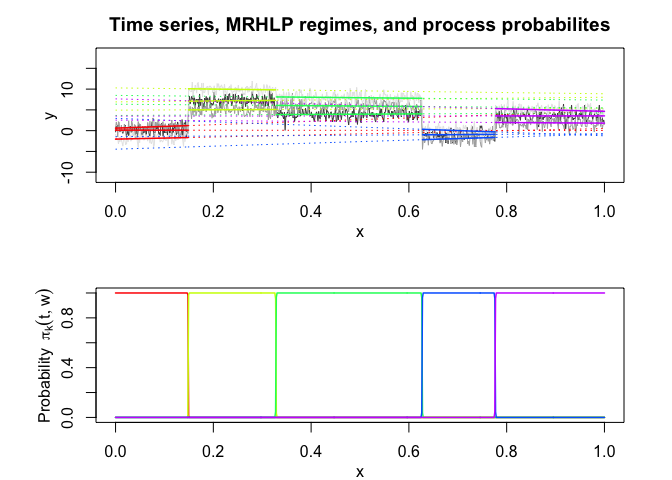
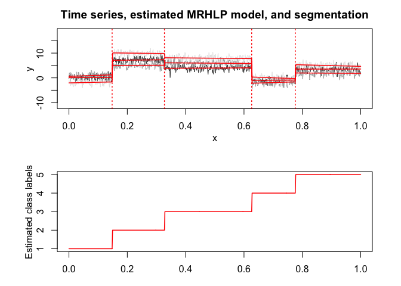
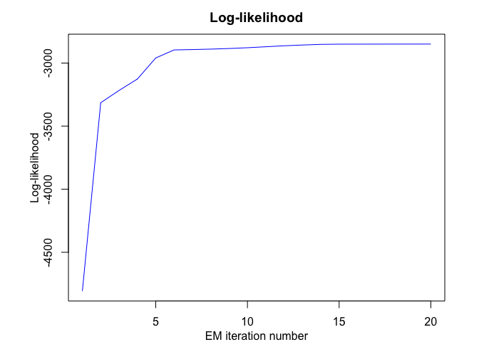
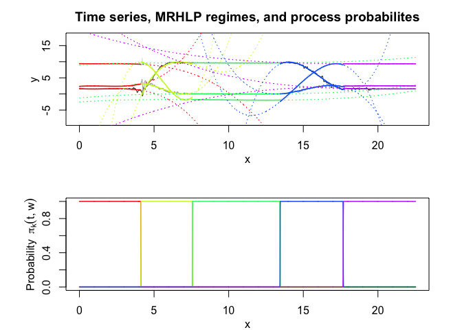
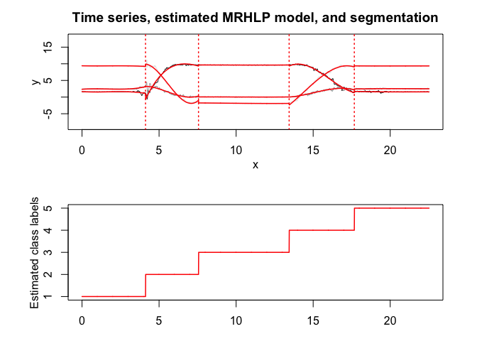
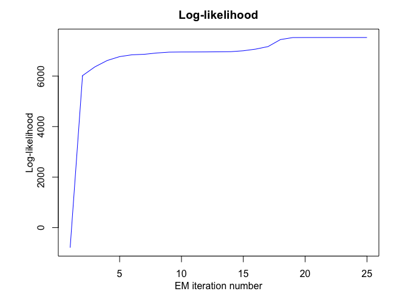
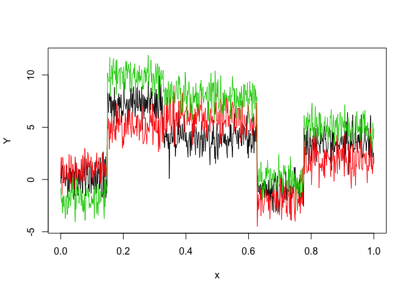

<!-- README.md is generated from README.Rmd. Please edit that file -->

<!-- badges: start -->

<!-- badges: end -->

# Overview

**MRHLP** is an R package for flexible and user-friendly
**probabilistic** joint **segmentation** of multivariate time series (or
multivariate structured longitudinal data) with smooth and/or abrupt
regime changes by a mixture model-based multiple regression approach
with a hidden logistic process (Multiple Regression model with a Hidden
Logistic Process (MRHLP)). The model is fitted by the EM algorithm.

# Installation

You can install the MRHLP package from [GitHub](https://github.com/)
with:

``` r
# install.packages("devtools")
devtools::install_github("fchamroukhi/MRHLP")
```

To build *vignettes* for examples of usage, type the command below
instead:

``` r
# install.packages("devtools")
devtools::install_github("fchamroukhi/MRHLP", 
                         build_opts = c("--no-resave-data", "--no-manual"), 
                         build_vignettes = TRUE)
```

Use the following command to display vignettes:

``` r
browseVignettes("MRHLP")
```

# Usage

``` r
library(MRHLP)
```

``` r
# Application to a toy data set
data("toydataset")
x <- toydataset$x
y <- toydataset[,c("y1", "y2", "y3")]

K <- 5 # Number of regimes (mixture components)
p <- 1 # Dimension of beta (order of the polynomial regressors)
q <- 1 # Dimension of w (order of the logistic regression: to be set to 1 for segmentation)
variance_type <- "heteroskedastic" # "heteroskedastic" or "homoskedastic" model

n_tries <- 1
max_iter <- 1500
threshold <- 1e-6
verbose <- TRUE
verbose_IRLS <- FALSE

mrhlp <- emMRHLP(X = x, Y = y, K, p, q, variance_type, n_tries, 
                 max_iter, threshold, verbose, verbose_IRLS)
#> EM - MRHLP: Iteration: 1 | log-likelihood: -4807.6644322901
#> EM - MRHLP: Iteration: 2 | log-likelihood: -3314.25165556383
#> EM - MRHLP: Iteration: 3 | log-likelihood: -3216.8871750704
#> EM - MRHLP: Iteration: 4 | log-likelihood: -3126.33556053822
#> EM - MRHLP: Iteration: 5 | log-likelihood: -2959.59933830667
#> EM - MRHLP: Iteration: 6 | log-likelihood: -2895.65953485704
#> EM - MRHLP: Iteration: 7 | log-likelihood: -2892.93263500326
#> EM - MRHLP: Iteration: 8 | log-likelihood: -2889.34084959654
#> EM - MRHLP: Iteration: 9 | log-likelihood: -2884.56422084139
#> EM - MRHLP: Iteration: 10 | log-likelihood: -2878.29772085061
#> EM - MRHLP: Iteration: 11 | log-likelihood: -2870.61242183846
#> EM - MRHLP: Iteration: 12 | log-likelihood: -2862.86238149363
#> EM - MRHLP: Iteration: 13 | log-likelihood: -2856.85351443338
#> EM - MRHLP: Iteration: 14 | log-likelihood: -2851.74642203885
#> EM - MRHLP: Iteration: 15 | log-likelihood: -2850.00381259526
#> EM - MRHLP: Iteration: 16 | log-likelihood: -2849.86516522686
#> EM - MRHLP: Iteration: 17 | log-likelihood: -2849.7354103643
#> EM - MRHLP: Iteration: 18 | log-likelihood: -2849.56953544124
#> EM - MRHLP: Iteration: 19 | log-likelihood: -2849.40322468732
#> EM - MRHLP: Iteration: 20 | log-likelihood: -2849.40321381274

mrhlp$summary()
#> ----------------------
#> Fitted MRHLP model
#> ----------------------
#> 
#> MRHLP model with K = 5 regimes
#> 
#>  log-likelihood nu       AIC       BIC       ICL
#>       -2849.403 68 -2917.403 -3070.651 -3069.896
#> 
#> Clustering table:
#>   1   2   3   4   5 
#> 100 120 200 100 150 
#> 
#> 
#> ------------------
#> Regime 1 (k = 1):
#> 
#> Regression coefficients:
#> 
#>     Beta(d = 1) Beta(d = 2) Beta(d = 3)
#> 1    0.11943184   0.6087582   -2.038486
#> X^1 -0.08556857   4.1038126    2.540536
#> 
#> Covariance matrix:
#>                                    
#>  1.19063336  0.12765794  0.05537134
#>  0.12765794  0.87144062 -0.05213162
#>  0.05537134 -0.05213162  0.87885166
#> ------------------
#> Regime 2 (k = 2):
#> 
#> Regression coefficients:
#> 
#>     Beta(d = 1) Beta(d = 2) Beta(d = 3)
#> 1      6.924025   4.9368460   10.288339
#> X^1    1.118034   0.4726707   -1.409218
#> 
#> Covariance matrix:
#>                                   
#>   1.0690431 -0.18293369 0.12602459
#>  -0.1829337  1.05280632 0.01390041
#>   0.1260246  0.01390041 0.75995058
#> ------------------
#> Regime 3 (k = 3):
#> 
#> Regression coefficients:
#> 
#>     Beta(d = 1) Beta(d = 2) Beta(d = 3)
#> 1     3.6535241   6.3654379    8.488318
#> X^1   0.6233579  -0.8866887   -1.126692
#> 
#> Covariance matrix:
#>                                     
#>   1.02591553 -0.05445227 -0.02019896
#>  -0.05445227  1.18941700  0.01565240
#>  -0.02019896  0.01565240  1.00257195
#> ------------------
#> Regime 4 (k = 4):
#> 
#> Regression coefficients:
#> 
#>     Beta(d = 1) Beta(d = 2) Beta(d = 3)
#> 1     -1.439637   -4.463014    2.952470
#> X^1    0.703211    3.649717   -4.187703
#> 
#> Covariance matrix:
#>                                     
#>   0.88000190 -0.03249118 -0.03411075
#>  -0.03249118  1.12087583 -0.07881351
#>  -0.03411075 -0.07881351  0.86060127
#> ------------------
#> Regime 5 (k = 5):
#> 
#> Regression coefficients:
#> 
#>     Beta(d = 1) Beta(d = 2) Beta(d = 3)
#> 1     3.4982408   2.5357751    7.652113
#> X^1   0.0574791  -0.7286824   -3.005802
#> 
#> Covariance matrix:
#>                                  
#>  1.13330209 0.25869951 0.03163467
#>  0.25869951 1.21230741 0.04746018
#>  0.03163467 0.04746018 0.80241715

mrhlp$plot()
```



``` r
# Application to a real data set (human activity recogntion data)
data("realdataset")
x <- realdataset$x
y <- realdataset[,c("y1", "y2", "y3")]

K <- 5 # Number of regimes (mixture components)
p <- 3 # Dimension of beta (order of the polynomial regressors)
q <- 1 # Dimension of w (order of the logistic regression: to be set to 1 for segmentation)
variance_type <- "heteroskedastic" # "heteroskedastic" or "homoskedastic" model

n_tries <- 1
max_iter <- 1500
threshold <- 1e-6
verbose <- TRUE
verbose_IRLS <- FALSE

mrhlp <- emMRHLP(X = x, Y = y, K, p, q, variance_type, n_tries, 
                 max_iter, threshold, verbose, verbose_IRLS)
#> EM - MRHLP: Iteration: 1 | log-likelihood: -792.888668727036
#> EM - MRHLP: Iteration: 2 | log-likelihood: 6016.45835957306
#> EM - MRHLP: Iteration: 3 | log-likelihood: 6362.81791662824
#> EM - MRHLP: Iteration: 4 | log-likelihood: 6615.72233403002
#> EM - MRHLP: Iteration: 5 | log-likelihood: 6768.32107943849
#> EM - MRHLP: Iteration: 6 | log-likelihood: 6840.97339565987
#> EM - MRHLP: Iteration: 7 | log-likelihood: 6860.97262839295
#> EM - MRHLP: Iteration: 8 | log-likelihood: 6912.25605673784
#> EM - MRHLP: Iteration: 9 | log-likelihood: 6945.96718258737
#> EM - MRHLP: Iteration: 10 | log-likelihood: 6951.28584396645
#> EM - MRHLP: Iteration: 11 | log-likelihood: 6952.37644678517
#> EM - MRHLP: Iteration: 12 | log-likelihood: 6954.80510338749
#> EM - MRHLP: Iteration: 13 | log-likelihood: 6958.99033092484
#> EM - MRHLP: Iteration: 14 | log-likelihood: 6964.81099837456
#> EM - MRHLP: Iteration: 15 | log-likelihood: 6999.90358068156
#> EM - MRHLP: Iteration: 16 | log-likelihood: 7065.39327246318
#> EM - MRHLP: Iteration: 17 | log-likelihood: 7166.23398344994
#> EM - MRHLP: Iteration: 18 | log-likelihood: 7442.73330846285
#> EM - MRHLP: Iteration: 19 | log-likelihood: 7522.65416438396
#> EM - MRHLP: Iteration: 20 | log-likelihood: 7524.41524338024
#> EM - MRHLP: Iteration: 21 | log-likelihood: 7524.57590110924
#> EM - MRHLP: Iteration: 22 | log-likelihood: 7524.73808801417
#> EM - MRHLP: Iteration: 23 | log-likelihood: 7524.88684996651
#> EM - MRHLP: Iteration: 24 | log-likelihood: 7524.9753964817
#> EM - MRHLP: Iteration: 25 | log-likelihood: 7524.97701548847

mrhlp$summary()
#> ----------------------
#> Fitted MRHLP model
#> ----------------------
#> 
#> MRHLP model with K = 5 regimes
#> 
#>  log-likelihood nu      AIC      BIC      ICL
#>        7524.977 98 7426.977 7146.696 7147.535
#> 
#> Clustering table:
#>   1   2   3   4   5 
#> 413 344 588 423 485 
#> 
#> 
#> ------------------
#> Regime 1 (k = 1):
#> 
#> Regression coefficients:
#> 
#>     Beta(d = 1) Beta(d = 2) Beta(d = 3)
#> 1    1.64847721  2.33823068  9.40173242
#> X^1 -0.31396583  0.38235782 -0.10031616
#> X^2  0.23954454 -0.30105177  0.07812145
#> X^3 -0.04725267  0.06166899 -0.01586579
#> 
#> Covariance matrix:
#>                                          
#>   0.0200740364 -0.004238036  0.0004011388
#>  -0.0042380363  0.006082904 -0.0012973026
#>   0.0004011388 -0.001297303  0.0013201963
#> ------------------
#> Regime 2 (k = 2):
#> 
#> Regression coefficients:
#> 
#>      Beta(d = 1) Beta(d = 2)  Beta(d = 3)
#> 1   -106.0250571 -31.4671946 -107.9697464
#> X^1   45.2035210  21.2126134   72.0220177
#> X^2   -5.7330338  -4.1285514  -13.9857795
#> X^3    0.2343552   0.2485377    0.8374817
#> 
#> Covariance matrix:
#>                                     
#>   0.11899225 -0.03866052 -0.06693441
#>  -0.03866052  0.17730401  0.04036629
#>  -0.06693441  0.04036629  0.11983979
#> ------------------
#> Regime 3 (k = 3):
#> 
#> Regression coefficients:
#> 
#>       Beta(d = 1)  Beta(d = 2)  Beta(d = 3)
#> 1    9.0042249443 -1.247752962 -2.492119515
#> X^1  0.2191555621  0.418071041  0.310449523
#> X^2 -0.0242080660 -0.043802827 -0.039012607
#> X^3  0.0008494208  0.001474635  0.001427627
#> 
#> Covariance matrix:
#>                                          
#>   4.103351e-04 -0.0001330363 5.289199e-05
#>  -1.330363e-04  0.0006297205 2.027763e-04
#>   5.289199e-05  0.0002027763 1.374405e-03
#> ------------------
#> Regime 4 (k = 4):
#> 
#> Regression coefficients:
#> 
#>       Beta(d = 1) Beta(d = 2)  Beta(d = 3)
#> 1   -1029.9071752 334.4975068  466.0981076
#> X^1   199.9531885 -68.7252041 -105.6436899
#> X^2   -12.6550086   4.6489685    7.6555642
#> X^3     0.2626998  -0.1032161   -0.1777453
#> 
#> Covariance matrix:
#>                                       
#>   0.058674116 -0.017661572 0.002139975
#>  -0.017661572  0.047588713 0.007867532
#>   0.002139975  0.007867532 0.067150809
#> ------------------
#> Regime 5 (k = 5):
#> 
#> Regression coefficients:
#> 
#>      Beta(d = 1)   Beta(d = 2)  Beta(d = 3)
#> 1   27.247199195 -14.393798357 19.741283724
#> X^1 -3.530625667   2.282492947 -1.511225702
#> X^2  0.161234880  -0.101613670  0.073003292
#> X^3 -0.002446104   0.001490288 -0.001171127
#> 
#> Covariance matrix:
#>                                          
#>   6.900384e-03 -0.001176838  2.966199e-05
#>  -1.176838e-03  0.003596238 -2.395420e-04
#>   2.966199e-05 -0.000239542  5.573451e-04

mrhlp$plot()
```



# Model selection

In this package, it is possible to select models based on information
criteria such as **BIC**, **AIC** and **ICL**.

The selection can be done for the two following parameters:

  - **K**: The number of regimes;
  - **p**: The order of the polynomial regression.

Let’s select a MRHLP model for the following multivariate time series
**Y**:

``` r
data("toydataset")
x <- toydataset$x
y <- toydataset[, c("y1", "y2", "y3")]
matplot(x, y, type = "l", xlab = "x", ylab = "Y", lty = 1)
```



``` r
selectedmrhlp <- selectMRHLP(X = x, Y = y, Kmin = 2, Kmax = 6, pmin = 0, pmax = 3)
#> Warning in emMRHLP(X = X1, Y = Y1, K, p): EM log-likelihood is decreasing
#> from -3105.78591044952to -3105.78627830471!
#> The MRHLP model selected via the "BIC" has K = 5 regimes 
#>  and the order of the polynomial regression is p = 0.
#> BIC = -3033.20042397111
#> AIC = -2913.75756459291

selectedmrhlp$plot(what = "estimatedsignal")
```


