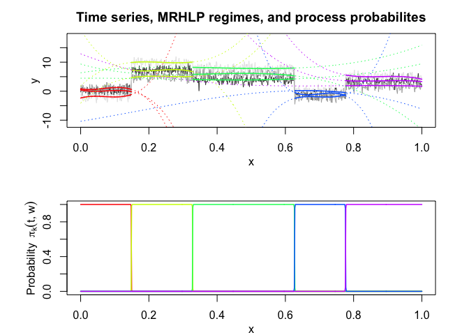

<!-- README.md is generated from README.Rmd. Please edit that file -->

## Overview

<!-- badges: start -->

<!-- badges: end -->

User-friendly and flexible algorithm for time series **segmentation** of
multivariate time series with a Multiple Regression model with a Hidden
Logistic Process (MRHLP).

## Installation

You can install the development version of MRHLP from
[GitHub](https://github.com/) with:

``` r
# install.packages("devtools")
devtools::install_github("fchamroukhi/MRHLP")
```

To build *vignettes* for examples of usage, type the command below
instead:

``` r
# install.packages("devtools")
devtools::install_github("fchamroukhi/MRHLP", 
                         build_opts = c("--no-resave-data", "--no-manual"), 
                         build_vignettes = TRUE)
```

Use the following command to display vignettes:

``` r
browseVignettes("MRHLP")
```

## Usage

``` r
library(MRHLP)

data("simulatedtimeseries")

K <- 5 # Number of regimes (mixture components)
p <- 3 # Dimension of beta (order of the polynomial regressors)
q <- 1 # Dimension of w (order of the logistic regression: to be set to 1 for segmentation)
variance_type <- "heteroskedastic" # "heteroskedastic" or "homoskedastic" model

n_tries <- 1
max_iter = 1500
threshold <- 1e-6
verbose <- TRUE
verbose_IRLS <- FALSE

mrhlp <- emMRHLP(simulatedtimeseries$X, simulatedtimeseries[,2:ncol(simulatedtimeseries)],  
                 K, p, q, variance_type, n_tries, max_iter, threshold, verbose,
                 verbose_IRLS)

mrhlp$summary()
#> ----------------------
#> Fitted MRHLP model
#> ----------------------
#> 
#> MRHLP model with K = 5 regimes
#> 
#>  log-likelihood nu       AIC       BIC       ICL
#>       -2831.065 33 -2864.065 -2849.192 -2848.416
#> 
#> Clustering table:
#>   1   2   3   4   5 
#> 100 120 200 100 150 
#> 
#> 
#> ------------------
#> Regime 1 (K = 1):
#> 
#> Regression coefficients:
#> 
#>       Beta(d = 1)   Beta(d = 2) Beta(d = 3)
#> 1       0.4466558     0.8104534    -2.36719
#> X^1   -25.5100013   -20.5995360    32.75195
#> X^2   413.8717640   498.0085618  -541.38904
#> X^3 -1811.4612012 -2477.5546420  2523.64723
#> 
#> Covariance matrix:
#>                                   
#>  1.17712613  0.1114059  0.07303969
#>  0.11140591  0.8394152 -0.02442220
#>  0.07303969 -0.0244222  0.85240361
#> ------------------
#> Regime 2 (K = 2):
#> 
#> Regression coefficients:
#> 
#>     Beta(d = 1) Beta(d = 2) Beta(d = 3)
#> 1      21.30187   -4.108239    1.838238
#> X^1  -199.86512  112.953325  112.257782
#> X^2   905.60445 -449.623857 -493.914613
#> X^3 -1316.42937  581.197948  694.872075
#> 
#> Covariance matrix:
#>                                     
#>   1.0409982 -0.180821350 0.137568024
#>  -0.1808214  1.042169409 0.009699162
#>   0.1375680  0.009699162 0.754147599
#> ------------------
#> Regime 3 (K = 3):
#> 
#> Regression coefficients:
#> 
#>     Beta(d = 1) Beta(d = 2) Beta(d = 3)
#> 1     4.4721830    9.349642    6.349724
#> X^1   0.7467282  -33.315977   17.837763
#> X^2 -11.9302818   96.730621  -51.086769
#> X^3  16.1571109  -85.951201   42.760070
#> 
#> Covariance matrix:
#>                                     
#>   1.02026230 -0.04094457 -0.02544812
#>  -0.04094457  1.15656511  0.02852275
#>  -0.02544812  0.02852275  0.99750511
#> ------------------
#> Regime 4 (K = 4):
#> 
#> Regression coefficients:
#> 
#>     Beta(d = 1) Beta(d = 2) Beta(d = 3)
#> 1      1267.288   -840.5119   -10.37768
#> X^1   -5458.816   3613.7273    19.40201
#> X^2    7813.122  -5184.1100    14.37103
#> X^3   -3718.619   2475.7168   -29.55020
#> 
#> Covariance matrix:
#>                                       
#>   0.822157811  0.006792726 -0.03667011
#>   0.006792726  1.093351047 -0.07477892
#>  -0.036670114 -0.074778924  0.85425249
#> ------------------
#> Regime 5 (K = 5):
#> 
#> Regression coefficients:
#> 
#>     Beta(d = 1) Beta(d = 2) Beta(d = 3)
#> 1      194.7894    12.88268    483.8383
#> X^1   -658.4685   -45.73544  -1634.9482
#> X^2    753.1086    61.92925   1858.1529
#> X^3   -286.1078   -27.37495   -702.9064
#> 
#> Covariance matrix:
#>                                 
#>  1.1282728 0.25684915 0.02034990
#>  0.2568491 1.21055927 0.04414336
#>  0.0203499 0.04414336 0.77644297

mrhlp$plot()
```


